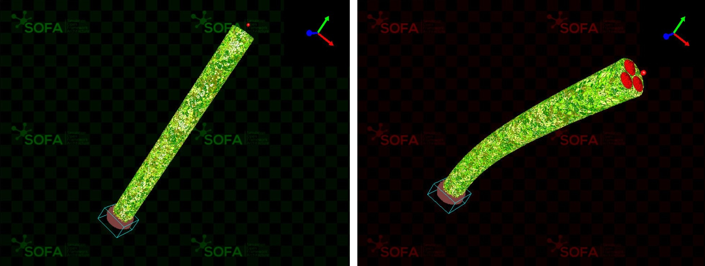
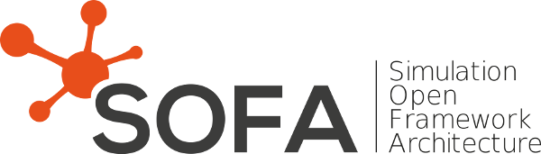

# Pneumatic Actuation Controller

## Assignment Details

On docs/assignment.pdf a detailed description of the exercise is given.

The objective of this assignment is to test programming capabilites, control theory and simple material knowledge. This will include setting up the soft simulation software on your computer, completing the Python simulation file and giving small descriptions on the given questions.

The results of this exercise will be a zip file with a .txt (template on docs/) containing the best achieved positions together with screenshots for each target where the strain can be **clearly visible** as well as the coordinate frame of the simulation. The zip will also contain a file named *controller.py* where your implementation of a class named *SoftBodyController* shall be present. This zip will be named **lastname.firstname.zip**.

  

## SOFA Installation

The installation guide of the simulation tool can be found in the following link [SOFA Framework Releases (v24.12)](!https://github.com/sofa-framework/sofa/releases/tag/v24.12.00). The simplest installation is on Windows, but it is also possible to setup on Linux and MacOS (yet requires more knowledge on building software from source).

Once installed, start the simulation tool and select on the GUI top-left menu **File**. Select the *assignment.py* that you have read and completed where necessary. More information can be found on the [SOFA Documentation](!https://sofa-framework.github.io/doc/using-sofa/runsofa/).

  

## Problems & Related Issues

If you face any problems while doing the exercise, feel free to open an issue on the matter in this repository.

If you receive no response within a week and cannot resolve the issue, please send a mail to the following address **fernando.labra.caso@ltu.se** with the subject **SUPPORT : Pneumatic Actuation Controller**